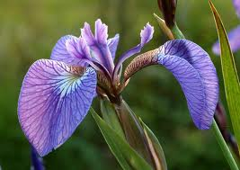
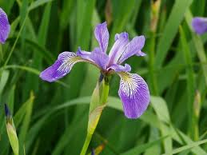
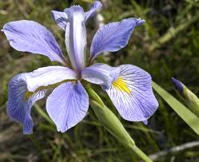
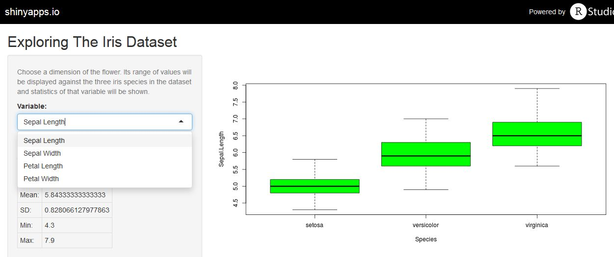

## Edgar Anderson's Iris Data

This famous (Fisher's or Anderson's) iris data set gives the measurements in centimeters of the variables sepal length and width and petal length and width.

The data contains 50 flowers from each of 3 species of iris:

- Iris setosa
- Iris versicolor
- Iris virginica

This app will guide you to explore this data set, in particular the distributions of values of each of the variables for each of the species. 

--- 

## Iris species 

*Iris setosa* | *Iris versicolor* | *Iris virginica* 
------------- | ----------------- | -----------------
    |  |         

---

## The App

 

The app provides a menu to choose a variable, corresponding to a flower dimension. 

  
 

Once a variable is chosen, its range of values will be displayed against the three iris species in the dataset. Also, statistics of that variable will be shown under the menu box. 

You can also choose whether to show the outliers in the plot.

---

## The code behind the app 

Code similar to this one is used to display the plot for the Sepal.Width case with outliers. 

In the actual app code the name of the variable to display and whether to display outliers ("outline" value) are constructed programmatically from user input.


```{r, fig.align='center', fig.width=4, fig.height=4}
library(ggplot2)
data(iris)
boxplot(Sepal.Width ~ Species, data = iris, outline = TRUE, xlab="Species", ylab="Sepal Width", col="green")
```


